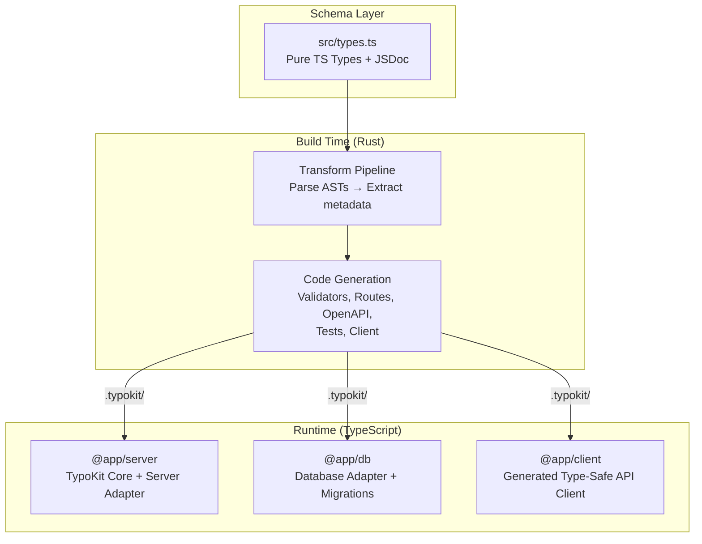
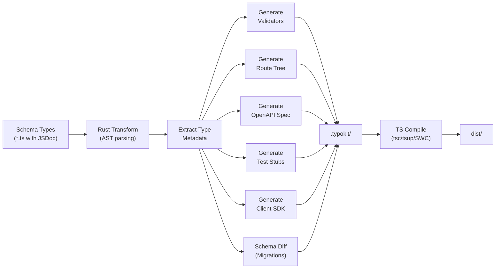
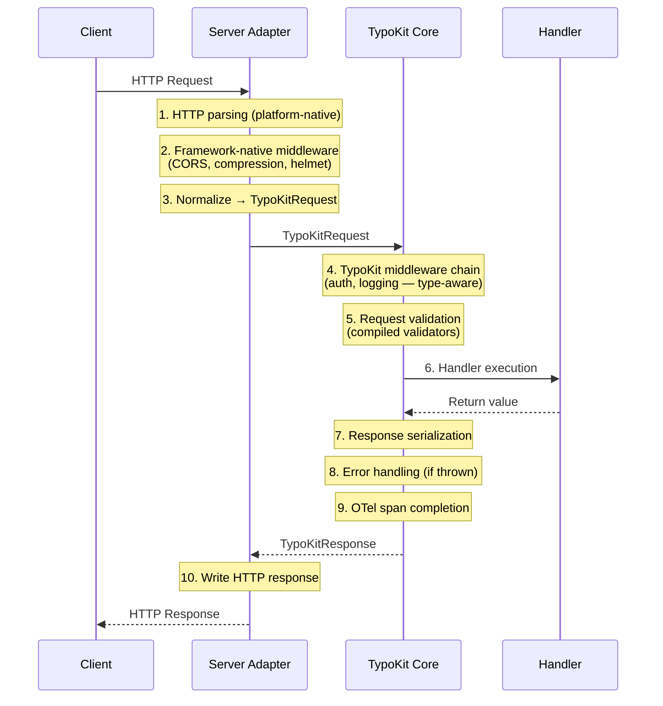

import { Aside } from '@astrojs/starlight/components';

TypoKit is a **schema-first, type-driven framework** where TypeScript types are the single source of truth for the entire stack. Types define your API contracts, database schemas, validation rules, client SDKs, and tests — all generated from one place.

<Aside type="note">
The full architectural document lives at [`typokit-arch.md`](https://github.com/kbastien/typokit/blob/main/typokit-arch.md) in the repository root. This page is a condensed overview for contributors and advanced users.
</Aside>

## High-Level Architecture

The system separates into three tiers:

1. **Schema layer** — Pure TypeScript types with JSDoc metadata. Zero runtime dependencies. Everything downstream derives from here.
2. **Build time** — A Rust-powered transform pipeline (via napi-rs) parses type ASTs, extracts metadata, and generates TypeScript artifacts into `.typokit/`.
3. **Runtime** — Standard TypeScript code consumes the generated artifacts for HTTP serving, database access, and API client usage.

## Package Responsibilities

TypoKit is a monorepo with focused, single-responsibility packages:

### Core

| Package | Description |
|---------|-------------|
| `@typokit/core` | Central runtime — routing, middleware pipeline, handler execution, plugin system, error handling |
| `@typokit/types` | Shared TypeScript type definitions used across all packages |
| `@typokit/errors` | Structured error classes with machine-readable context for AI agents |
| `@typokit/cli` | CLI tool — `typokit init`, `build`, `dev`, `generate`, `migrate`, `inspect` |

### Transform (Build Time)

| Package | Description |
|---------|-------------|
| `@typokit/transform-native` | Rust-based AST parser and code generator (napi-rs). 20–70× faster than ts-morph |
| `@typokit/transform-typia` | Alternative transform using Typia for validator generation |

### Server Adapters

| Package | Description |
|---------|-------------|
| `@typokit/server-native` | Zero-dependency adapter using compiled radix tree directly. O(k) route lookup |
| `@typokit/server-fastify` | Adapter for Fastify — translates route table to Fastify-native registrations |
| `@typokit/server-hono` | Adapter for Hono — lightweight, works natively on Node, Bun, and Deno |
| `@typokit/server-express` | Adapter for Express — enables incremental migration of existing Express apps |

### Platform Adapters

| Package | Description |
|---------|-------------|
| `@typokit/platform-node` | Node.js-specific bindings (HTTP, fs, crypto) |
| `@typokit/platform-bun` | Bun-native bindings for optimal performance on Bun runtime |
| `@typokit/platform-deno` | Deno-native bindings with permission-aware APIs |

<Aside type="tip">
Server adapters and platform adapters are **orthogonal** — any server adapter works with any platform adapter. For example, `server-hono` + `platform-bun` uses Hono's router with Bun-native HTTP serving.
</Aside>

### Database Adapters

| Package | Description |
|---------|-------------|
| `@typokit/db-drizzle` | Generates Drizzle ORM schema files (per-table `.ts` files) |
| `@typokit/db-kysely` | Generates Kysely type definitions (single `database.ts`) |
| `@typokit/db-prisma` | Generates Prisma schema (`schema.prisma`) |
| `@typokit/db-raw` | Generates raw SQL DDL + TypeScript types |

### Testing & Observability

| Package | Description |
|---------|-------------|
| `@typokit/testing` | Test harness — `createTestClient`, `createIntegrationSuite`, `createFactory`, `toMatchSchema` |
| `@typokit/otel` | OpenTelemetry integration — auto-instrumented spans, structured logging, log-to-span bridging |

### Plugins

| Package | Description |
|---------|-------------|
| `@typokit/plugin-debug` | Debug sidecar exposing inspection endpoints on a separate port |
| `@typokit/plugin-ws` | WebSocket support — build-time codegen + runtime connection management |

### Client Generation

| Package | Description |
|---------|-------------|
| `@typokit/client` | Core generated type-safe API client |
| `@typokit/client-react-query` | React Query wrapper around the generated client |
| `@typokit/client-swr` | SWR wrapper around the generated client |

### Build Tooling

| Package | Description |
|---------|-------------|
| `@typokit/nx` | Nx plugin for monorepo build orchestration |
| `@typokit/turbo` | Turborepo plugin (alternative to Nx) |

## Build Pipeline Flow

The build pipeline is the core of TypoKit's architecture. It transforms plain TypeScript types into optimized runtime artifacts:

### Pipeline Phases

The build pipeline uses **AsyncSeriesHook** (tapable pattern) with six phases that plugins can hook into:

1. **beforeTransform** — Pre-processing, setup
2. **afterTypeParse** — Type metadata extracted, available for inspection
3. **afterValidators** — Compiled validators generated
4. **afterRouteTable** — Radix tree route table compiled
5. **emit** — All artifacts written to `.typokit/`
6. **done** — Build complete, cleanup

<Aside type="note">
The Rust transform generates **plain TypeScript files** in `.typokit/`. Standard TS compilers (tsc, tsup, SWC) then compile them to `dist/`. This avoids TypeScript compiler plugin fragility and keeps all generated code inspectable.
</Aside>

See the [Build Pipeline deep dive](/typokit/architecture/build-pipeline/) for implementation details.

## Request Processing Order

When an HTTP request arrives, it flows through three ordered layers with ten discrete steps:

**Key ordering principle:** Framework-native middleware (CORS, compression) runs **before** TypoKit normalization for HTTP-level concerns. TypoKit's typed middleware runs **after** normalization to ensure type-aware context transformation.

See the [Compiled Router deep dive](/typokit/architecture/compiled-router/) for route-matching internals.

## Key Design Decisions

| Decision | Rationale | Trade-off |
|----------|-----------|-----------|
| **Schema-first, plain TS types** | Single source of truth; Typia-inspired approach avoids runtime schema libraries | Requires build step; cannot be purely dynamic |
| **Rust build pipeline** | 20–70× faster than ts-morph; avoids TS compiler plugin fragility | napi-rs binding maintenance; platform-specific binaries |
| **Thrown errors over Result types** | Better AI ergonomics; centralized error middleware enriches all errors | Less functional purity |
| **Pluggable server adapters** | Reuse existing frameworks (Fastify, Hono, Express); bring your own HTTP layer | More abstraction layers |
| **Explicit route registration** | Traceable dependency graph; clearer for AI agents (no magic file-based routing) | More boilerplate in `app.ts` |
| **Generate types, not queries (no ORM)** | Works with Drizzle, Kysely, Prisma, or raw SQL; no lock-in | Developers handle their own queries |
| **Migrations never auto-apply** | Safety for destructive changes; AI and human review before apply | Extra manual step |
| **Typed middleware as context narrowing** | Type system communicates exactly what's available in each handler | Requires careful context type design |

## Deep Dives

For detailed implementation documentation, see:

- [**Build Pipeline**](/typokit/architecture/build-pipeline/) — Rust transform internals, tapable hooks, plugin integration
- [**Compiled Router**](/typokit/architecture/compiled-router/) — Radix tree construction, route matching, parameter extraction

<Aside type="tip">
For hands-on usage rather than architecture, start with the [Quickstart guide](/typokit/getting-started/quickstart/) or the [Building Your First API](/typokit/guides/building-first-api/) tutorial.
</Aside>
